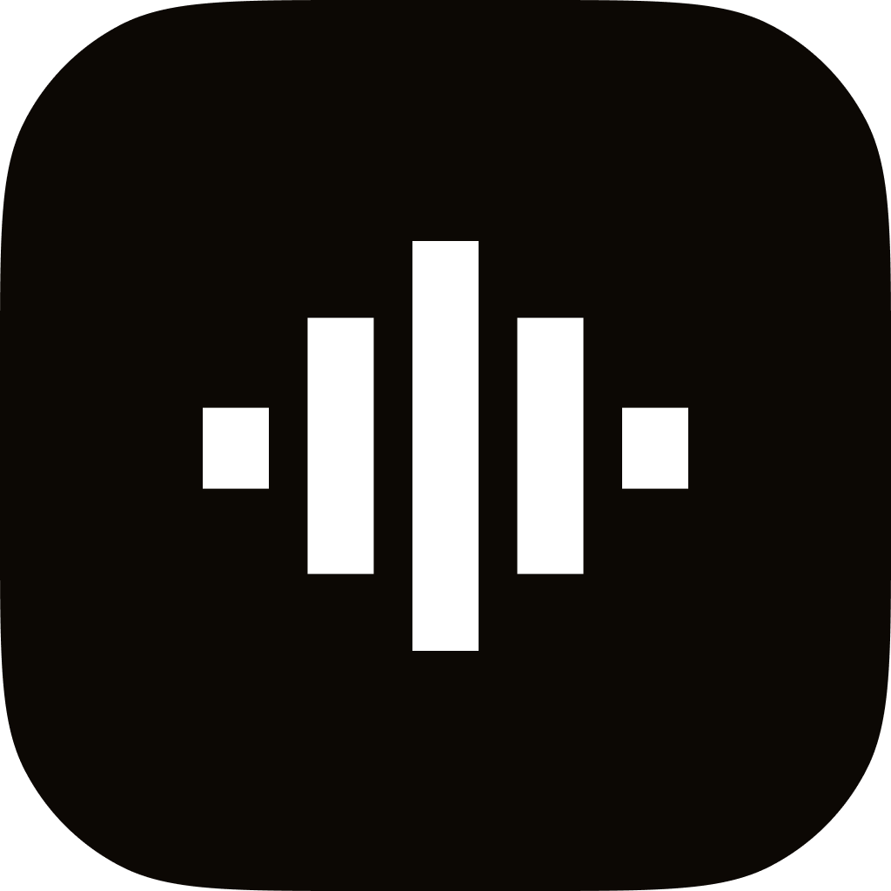
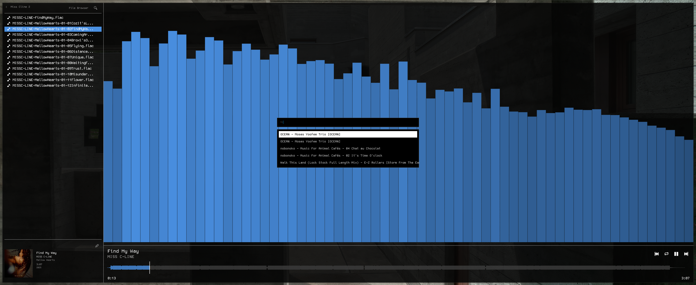

# WAVES

<div align="center">
  

  A cross-platform GUI music player written in Rust with real-time audio visualization

  
</div>

## Features

- **Miller Column Browser** - Navigate your music library with a macOS Finder-style interface
- **Real-time Audio Visualization** - FFT-based spectrum analyzer with 64 frequency bands
- **Waveform Display** - Visual representation of audio tracks with playback progress
- **Multiple Format Support** - Play MP3, WAV, FLAC, OGG, and M4A files
- **Metadata Editing** - Edit tags for all supported audio formats
- **Favorites System** - Mark and organize your favorite tracks and folders
- **Vim-style Keybindings** - Efficient keyboard navigation (h/j/k/l)
- **Cross-platform** - Runs on macOS, Linux, and Windows

## Installation

> **⚠️ macOS Users:** If you download the DMG from GitHub releases and see "Waves.app is damaged", **right-click the app** and select **"Open"** instead of double-clicking. This is a one-time step to bypass Gatekeeper. [See detailed instructions](INSTALL.md#first-time-opening-important)

### Prerequisites
- Rust toolchain (install from [rustup.rs](https://rustup.rs))

### Build from Source

```bash
# Clone the repository
git clone https://github.com/saravenpi/waves.git
cd waves

# Build release version
make release

# Or use cargo directly
cargo build --release
```

### Platform-Specific Installation

**macOS:**
```bash
./install-macos.sh
```
This creates a proper macOS app bundle in `/Applications` with file associations.

**Linux:**
```bash
chmod +x install-linux.sh && ./install-linux.sh
```
Installs to `~/.local/bin/waves` with desktop integration.

**Windows:**
```powershell
.\install-windows.ps1
```
Installs to `%LOCALAPPDATA%\Programs\WAVES` and adds to PATH.

## Usage

```bash
# Open in system music directory
waves

# Open specific folder
waves /path/to/music/folder

# Open and play specific file
waves /path/to/audio.mp3
```

### Keyboard Shortcuts

**Navigation:**
- `h/j/k/l` - Navigate left/down/up/right
- `Enter` or `l` - Select directory or play file
- `Tab` - Cycle views (Browser → Favorites → Settings)

**Playback:**
- `Space` - Pause/Resume
- `←/→` - Previous/Next track
- `↑/↓` - Volume up/down

**File Operations:**
- `y` - Copy (yank) file/folder
- `x` - Cut file/folder
- `p` - Paste into selected folder or current directory
- `r` - Rename selected item
- `d` - Delete selected item
- `n` - Create new folder
- `Esc` - Cancel clipboard operation

**Organization:**
- `f` - Toggle favorite
- `m` - Open metadata editor
- `Ctrl+F` or `/` - Search

## Configuration

Configuration file location:
- **macOS/Linux:** `~/.waves.yml`
- **Windows:** `%USERPROFILE%\.waves.yml`

Example configuration:

```yaml
animation: true
sidebar_position: right
decorations: false
window_corner_radius: 12.0
default_folder: "~/Music/Musa/"
show_status_bar: false
primary_color: "#9664FF"
window_opacity: 100.0
custom_font: "~/Library/Fonts/MyFont.ttf"
sidebar_width: 500.0
```

## Technical Details

### Architecture
- **GUI Framework:** eframe/egui
- **Audio Playback:** rodio
- **FFT Analysis:** rustfft with 4096-sample Hann window
- **Metadata:** id3, mp4ameta, metaflac, oggvorbismeta, and custom WAV support
- **Async Loading:** Channel-based background processing for waveforms and album art

### Supported Audio Formats
- MP3 (full metadata support)
- M4A/MP4 (full metadata support)
- FLAC (full metadata support)
- WAV (full metadata support via RIFF LIST INFO chunks)
- OGG/Vorbis/Opus (full metadata support)

## License

MIT License - see LICENSE file for details

## Author

Created by [@saravenpi](https://github.com/saravenpi)
